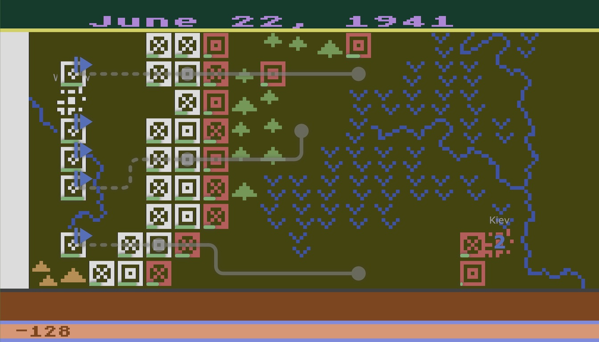

# Eastern Front 1941

This is a [playable][game] JavaScript port of [Chris Crawford][ccwiki]'s [Eastern Front 1941][efwiki] with a few extras.
Here's an annotated copy of the original manual if you just want to get to [playing](doc/playing.md).

[][game]

## But why?!

Some of my earliest video game memories are of hanging out after school
with a friend who had an [Atari 400][atari400] (maybe 800?)
not to mention an actual pong bar table :exploding_head:...
We played games like Pitfall, Missile Command, Defender and a rogue-like adventure game whose name I forget.
But Eastern Front was always my "can we play...?" go-to.
It was a compelling game in itself, with a fascinating AI opponent,
and one of my earliest introductions to wargaming.
Oddly enough I still haven't played an emulated version of the game,
though I have watched a few [playthrough videos][apxvideo].

When I discovered that Chris Crawford had published much of his early [source code][ccsrc],
including the [6502 assembler][6502] code for Eastern Front,
I couldn't resist taking it apart and trying to create a more accessible port.
My main goal was to understand [how it worked](doc/howitworks.md),
reminisce about later learning 6502 assembly on an [Apple //e](apple2e),
and perhaps encourage others to experiment further.
Along the way I gained a new appreciation for Crawford's technical tour-de-force:
implementing an interactive wargame with a credible AI in only 12,000 bytes
*including* all game data and graphics. It shipped on a 16K cartridge with 4K to spare.

This re-implementation tries to capture the spirit of the game -
reusing the same raw data, font map and color scheme -
without slavishly recreating the original.
(Emulators are already good at that.)
At the same time I wanted to make the data and logic more explicit
to make it more approachable and easier to modify.
For example data structures like the order-of-battle are still lists
accessed by index, but I've wrapped elements as simple objects
to attach meaningful names and methods to the content.
Similarly most magic constants now have named enumerations like `Terrain.river`.
Heck, my laptop has sixteen million times the memory
and perhaps ten thousand times the CPU power
so we can afford to be a little more verbose...

The current version apx

and perhaps encourage others to experiment with AI improvements,
an AI for the Germans or even fully computer play environment.

bugs are my own,  no real effort at performance efficiency

hard to imagine debugging and tuning the AI in 6502 asm (tho mentions basic).  much more complexity than
any assembler I've written.  respect

hope it's a resource for others to learn, perhaps experiment with AI improvements

fascinating simplicity of AI, no understanding of local tactics, ZoC etc

also working on an annotated disassembly of the cartridge version to catalog differences
and offer as options here. some minor things already incorporated.
plenty of interesting stuff in there

full disassembly of the APX disk image(ref) including transcribed comments/labels from the original notes

[game]: https://patricksurry.github.io/eastern-front-1941/
[ccwiki]: https://en.wikipedia.org/wiki/Chris_Crawford_(game_designer)
[efwiki]: https://en.wikipedia.org/wiki/Eastern_Front_(1941)
[ccsrc]: http://www.erasmatazz.com/library/source-code/index.html
[atari400]: https://en.wikipedia.org/wiki/Atari_8-bit_family
[6502]: https://en.wikibooks.org/wiki/6502_Assembly
[apple2e]: https://en.wikipedia.org/wiki/Apple_IIe

## What's what?

- `README.md` - you are here
- `index.html` - basic structure for the game display showing how the map layers stack within the scrolling container
- `src/` - the javascript, style sheet and fontmap image sprite that implement the game
  - `data.js` - prettified chunks of raw data that drive the game, e.g map, order-of-battle, colors, etc
  - `display.js` - D3-based html/css display interface simulating an Atari-esque character-based display
  - `map.js` - helpers for interacting with the map and its squares, wrapped as simple Location objects
  - `unit.js` - helpers for managing the units in the order-of-battle (oob) as simple Unit objects
  - `think.js` - re-implements the computer player algorithm
  - `main.js` - manages user interaction, computer thinking, turn processing and so on
  - `test.js` - simple unit-tests that run on startup to protect me from myself (see browser console)
- `doc` - content referenced in the README
- `scripts/` - various scripts to extract data from the original binary images
- `refdata/` - binary images for the APX and cartridge versions of the game, disassembled source and extracted data blobs
- `refdoc/` - various collected documents including a copy of the original annotated source code in `EFT*.ASM`
    with Chris Crawford's (searchable) [source notes][ccrtfnotes] and a more extensive [scanned PDF][ccpdfnotes]
    which includes additional diagrams and source dumps.
    I also extracted and reordered a subset of pages about the [AI][ccainotes].
    The original user manuals for both the [APX][apxmanual] and [cartridge][cartmanual] versions
    are worth a look, along with the boxed [map poster][mapposter] and an opening [APX screenshot][apxscreen]
    showing the initial score of 12.

[ccrtfnotes]: refdoc/Eastern%20Front%201941%20Essays.rtf
[ccpdfnotes]: refdoc/APX_Source_Code_for_Eastern_Front_1941_rev_2.pdf
[ccainotes]: refdoc/APX_Source_AI_Extract.pdf
[apxmanual]: refdoc/APX_Eastern_Front_1941.pdf
[cartmanual]: refdoc/eastern_front_atari_cartridge.pdf
[apxscreen]: refdoc/Ef1941scr.png
[mapposter]: refdoc/Eastern_Front_1941_Atari_poster_text.pdf

