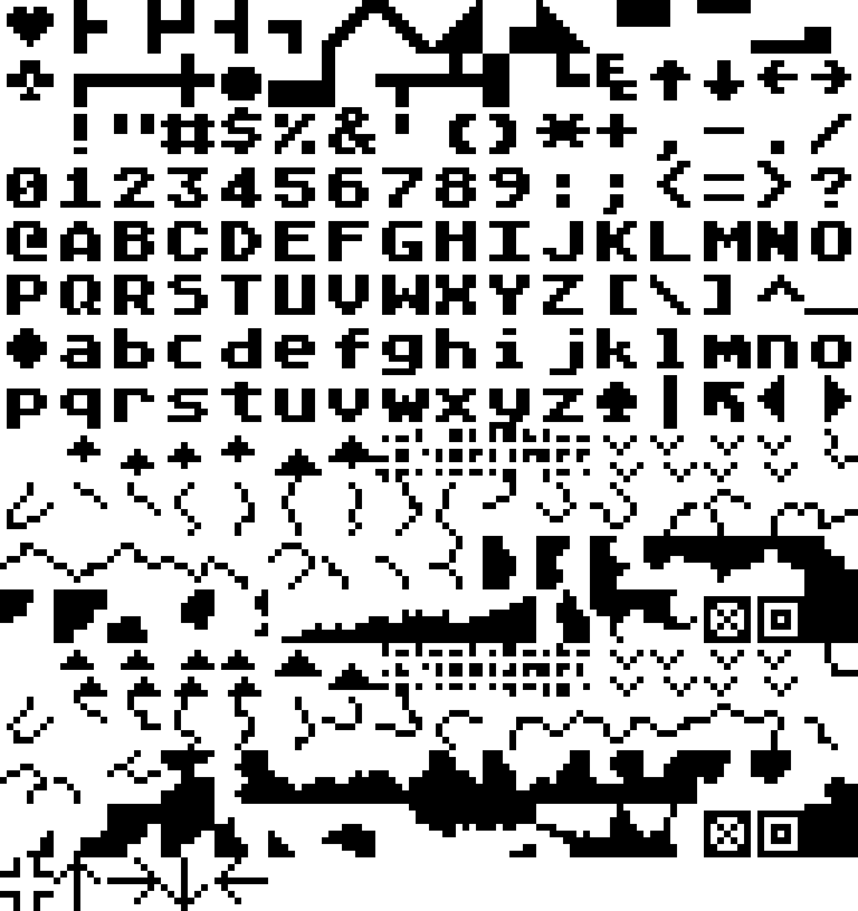
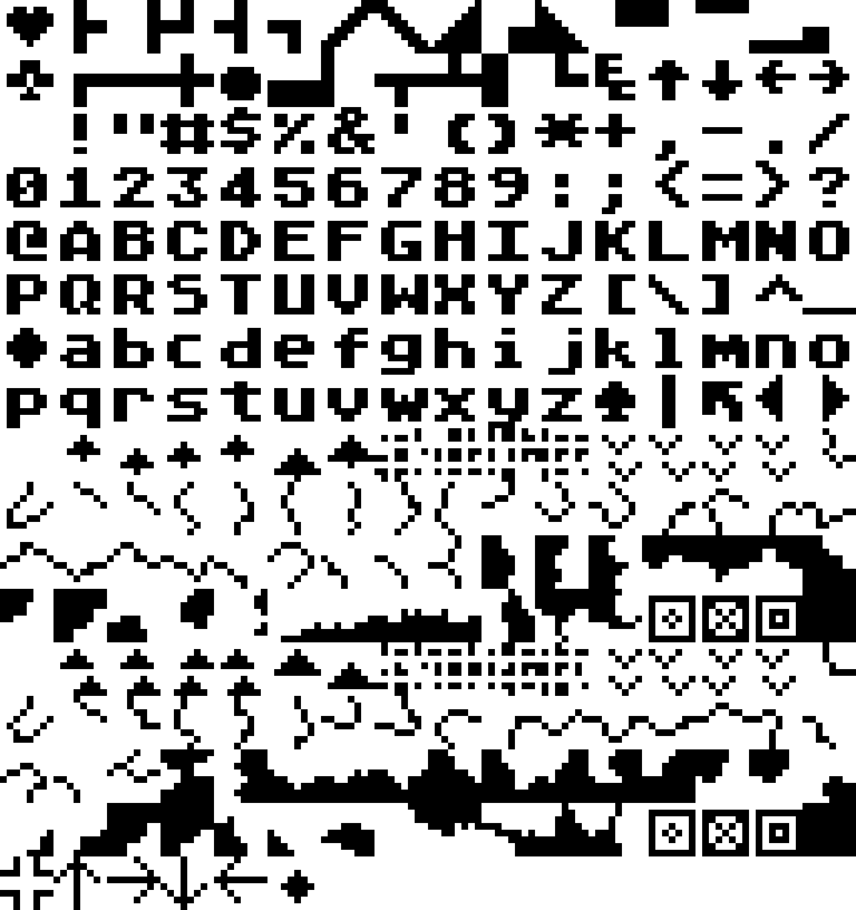
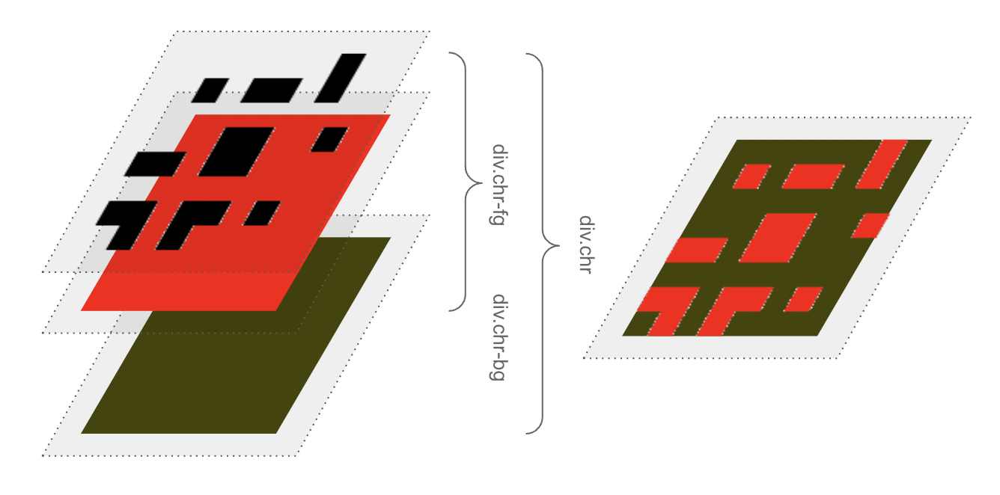
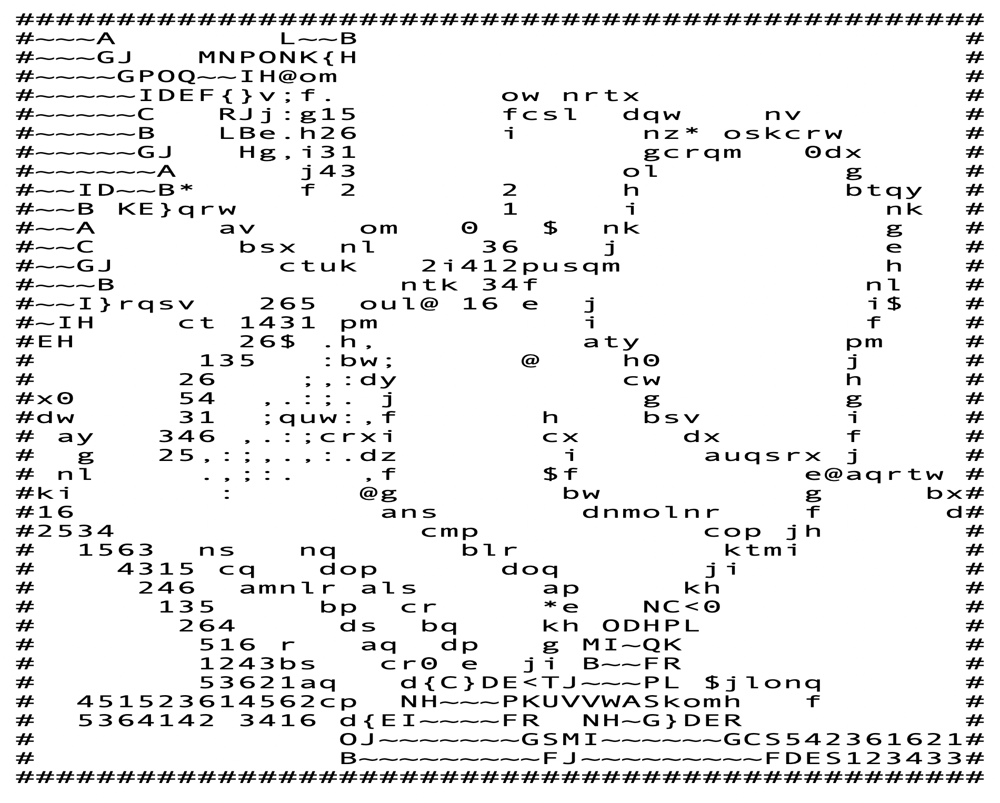
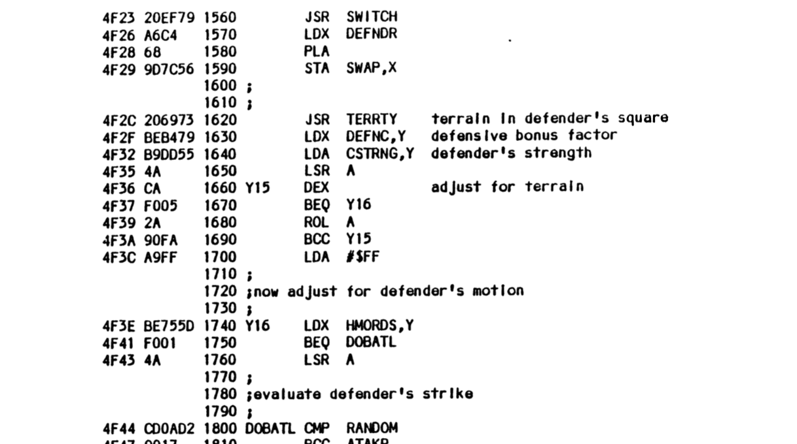

# Eastern Front 1941


This is a [playable][game] JavaScript port of [Chris Crawford][ccwiki]'s [Eastern Front 1941][efwiki] with a few optional extras.

[][game]

## But why?!

Some of my earliest video game memories are of hanging out after school
with a friend who had an [Atari 400][atari400] (or 800?)
not to mention an actual pong bar table :exploding_head:...
We played games like Pitfall, Missile Command, Defender and a rogue-like adventure game whose name I forget.
But Eastern Front was always the "can we play...?" go-to.
It was a compelling game in itself, with a fascinating AI opponent,
and one of my earliest introductions to wargaming.
Oddly enough I still haven't played an emulated version of the game,
though I have watched a few [playthrough videos][apxvideo].

When I discovered that Chris Crawford had published much of his early [source code][ccsrc],
including the [6502 assembler][6502] code for Eastern Front,
I couldn't resist taking it apart and trying to create a more accessible port.
My main goal was to understand how it worked,
have some fun reminiscing and perhaps encourage others to experiment further.
Along the way I gained a new appreciation for Crawford's technical tour-de-force:
implementing an interactive wargame with a credible AI in only 12,000 bytes
*including* all game data and graphics. It shipped on a 16K cartridge with 4K to spare.

This re-implementation tries to capture the spirit of the game -
reusing the same raw data, font map and color scheme -
without slavishy recreating the original.
(Emulators are already good at that.)
At the same time I wanted to make the data and logic more explicit
to make it more approachable and easier to modify.
For example data structures like the order-of-battle are still lists
accessed by index, but I've wrapped elements as simple objects
to attach meaningful names and methods to the content.
Similarly most magic constants now have named enumerations like `Terrain.river`.
Heck, my laptop has sixteen million times the memory and perhaps ten thousand times the CPU power
so we can afford to be a little more verbose...


The current version apx

and perhaps encourage others to experiment with AI improvements,
an AI for the Germans or even fully computer play environment.


bugs are my own,  no real effort at performance efficiency

hard to imagine debugging and tuning the AI in 6502 asm (tho mentions basic).  much more complexity than
any assembler I've written.  respect

hope it's a resource for others to learn, perhaps experiment with AI improvements

fascinating simplicity of AI, no understanding of local tactics, ZoC etc

also working on an annotated disassembly of the cartridge version to catalog differences
and offer as options here. some minor things already incorporated.
plenty of interesting stuff in there


full disassembly of the APX disk image(ref) including transcribed comments/labels from the original notes


[game]: https://patricksurry.github.io/eastern-front-1941/
[ccwiki]: https://en.wikipedia.org/wiki/Chris_Crawford_(game_designer)
[efwiki]: https://en.wikipedia.org/wiki/Eastern_Front_(1941)
[ccsrc]: http://www.erasmatazz.com/library/source-code/index.html
[atari400]: https://en.wikipedia.org/wiki/Atari_8-bit_family
[6502]: https://en.wikibooks.org/wiki/6502_Assembly


## What's what?

- `README.md` - you are here
- `index.html` - basic structure for the game display showing how the map layers stack within the scrolling container
- `static/` - the javascript, style sheet and fontmap image sprite that implement the game
    - `data.js` - prettified chunks of raw data that drive the game, e.g map, order-of-battle, colors, etc
    - `display.js` - D3-based html/css display interface simulating an Atari-esque character-based display
    - `map.js` - helpers for interacting with the map and its squares, wrapped as simple Location objects
    - `unit.js` - helpers for managing the units in the order-of-battle (oob) as simple Unit objects
    - `think.js` - re-implements the computer player algorithm
    - `main.js` - manages user interaction, computer thinking, turn processing and so on
    - `test.js` - simple unit-tests that run on startup to protect me from myself (see browser console)
- `doc` - content referenced in the README
- `scripts/` - various scripts to extract data from the original binary images
- `refdata/` - binary images for the APX and cartridge versions of the game, disassembled source and extracted data blobs
- `refdoc/` - various collected documents including a copy of the original annotated source code in `EFT*.ASM`
    with Chris Crawford's (searchable) [source notes][ccrtfnotes] and a more extensive [scanned PDF][ccpdfnotes]
    which includes additional diagrams and source dumps.
    I also extracted and reordered a subset of pages about the [AI][ccainotes].
    The original user manuals for both the [APX][apxmanual] and [cartridge][cartmanual] versions
    are worth a look, along with the boxed [map poster][mapposter] and an opening [APX screenshot][apxscreen]
    showing the initial score of 12.

[ccrtfnotes]: refdoc/Eastern%20Front%201941%20Essays.rtf
[ccpdfnotes]: refdoc/APX_Source_Code_for_Eastern_Front_1941_rev_2.pdf
[ccainotes]: refdoc/APX_Source_AI_Extract.pdf
[apxmanual]: refdoc/APX_Eastern_Front_1941.pdf
[cartmanual]: refdoc/eastern_front_atari_cartridge.pdf
[apxscreen]: refdoc/Ef1941scr.png
[mapposter]: refdoc/Eastern_Front_1941_Atari_poster_text.pdf


## Code structure

### Fonts

The original game uses Atari's builtin [atascii][atascii] font for text,
two custom 64 character fonts to display the northern and southern parts of the map,
as well as several additional custom sprite characters for the movement arrows and [maltakreuze][maltakreuze].
The game dynamically also changes the foreground and background colors as the seasons change
and to distinguish Russian from German units and cities.
The images below show all the characters used in the APX and cartridge versions respectively,
with the builtin characters in the top half, the custom map characters in the bottom half
(note the trees vs mountains and differences in river and coastline shapes),
plus the extra sprite characters at the bottom.
The cartridge version (right) drops one coastline character in favor of the new Flieger unit.

<p align="center">
    
    &nbsp;&nbsp;
    
</p>

One of my first challenges was to preserve that look using some combination of HTML, SVG and CSS.
After a few false starts, I discovered I could use an image with transparent background as a CSS `mask-image`
to cut from a square filled with foreground color, and stack that on a square filled with background color.
Thus each character is a `div.chr` containing a `div.fg-chr` atop a `div.bg-chr` as shown below.
We cut out the character we want by masking with a single image sprite containing all the characters
and setting an appropriate `mask-position`.

<p align="center"></p>

### The map

The [original map][apxmapdata] is stored as 8-bit binary data with one byte per map square.
The lower six bits index into one the custom north or south font based on the square's latitude,
with the two upper bits choosing the color channel.
(The cartridge goes an extra step with a custom run-length coding but unpacks to essentially the same thing.)
Including the raw map data as a base64'd binary blob or whatever seemed like a cop out,
so I took a detour to re-encode using a custom base65 mapping
where each terrain type maps to a group of related printable characters:
space for clear, numbers for trees/mountains, upper and lowercase letters for coastlines and rivers respectively, and so on.
That makes the [javascript map data][jsmapdata] much more accessible and (if we're careful) even editable?!

<p align="center"></p>

slight differences between the APX map (pictured) and the cartridge version

[atascii]: https://en.wikipedia.org/wiki/ATASCII
[maltakreuze]: https://en.wikipedia.org/wiki/Maltese_cross
[apxmapdata]: https://github.com/patricksurry/eastern-front-1941/blob/main/refdata/apxdump.asm#L1527
[jsmapdata]: https://github.com/patricksurry/eastern-front-1941/blob/main/static/data.js#L202


### Disassembly

    python ../pydisass6502/disass.py -i apxdump.dat -o apxdump.asm -e apxdump.map.json -c apxdump.stats -m ../pydisass6502/lib/atari-mapping.json

    python ../pydisass6502/disass.py -i cartridge.rom -o cartridge.asm -e cartridge.map.json -c cartridge.stats -m ../pydisass6502/lib/atari-mapping.json


### Additions, changes and observations

- unit paths
- unit reach
- why 8 order limit (just 8 x 2 bits = 2 bytes)?
- A* path finding; v Bresenham
- more random retreat/supply check for n/s

- more efficient impassable hex check?
- do linepoints N/S at same time (one rotartion vs three)

notes, fun discoveries

- why is Sevastpol listed as a scoring city in APX version but not represented on the map in either version?

- unused unit types: ASM vs Cart, injects other words in gaps, reorders second group

        "        ",        "",
x       "SS      ",        ["CORPS",]
        "FINNISH ",        "FINNISH",
        "RUMANIAN",        "RUMANIAN",
        "ITALIAN ",        "ITALIAN",
        "HUNGARAN",        "HUNGARIAN",
x        "MOUNTAIN",       ["ARMY",]
        "GUARDS  ",        "GUARDS",

        "INFANTRY",        "INFANTRY",
        "TANK    ",        "MILITIA",
        "CAVALRY ",        ["MUSTER",]
        "PANZER  ",        "FLIEGER",
        "MILITIA ",        "PANZER",
x        "SHOCK   ",       "TANK",
x        "PARATRP ",       "CAVALRY",
x        "PZRGRNDR",       ["COMBAT",]


- APX version allows attacker response even if the defender attack breaks it, cart adds `bcc ATAKR / jmp ENDCOM`

- APX gives MSTRNG+2 to russian in supply via `inc MSTRNG,x`, cart doesn't

- APX has fixed damage 1/5; cart is variable

- possible APX bugs, e.g. freezing Kerch straits, the corps,x/y issue differs in binary, notes (2 versions?)

    "russian units would advance into better positions during the retreat phase" bug mentioned in the [Opponents Undaunted][cpw120] piece in this old Computer Gaming world piece pdf p32-33

[cpw120]: https://www.cgwmuseum.org/galleries/issues/cgw_120.pdf

- cartridge bug - TERRTY should shift estuary check one down

- overlapping data structures, phantom offsets

- variable precision division sliding scale

- square spirals 2 * n(n-1)/2 + n = n^2

- cartridge changes
    - refactoring w subroutines
    - difficulty level, start date
    - map tweaks (for flieger)
    - flieger units, difficulty levels (vs handicap)
    - fogofwar using code as seed
    - run length coding for map
    - attack even if defender wins first?
    - division
    - dnumbr rewritten from 768 bytes of lookup tables to 39 bytes of code


anatomy of a bug

from apx disassembly preparing for defender strike

```asm
            jsr SWITCH      ; 4f23 20ef79  replace original unit character
            ldx DEFNDR      ; 4f26 a6c4
            pla             ; 4f28 68
            sta SWAP,x      ; 4f29 9d7c56  . terrain code underneath unit
            jsr TERRTY      ; 4f2c 206973  . convert map chr in TRNCOD -> TRNTYP, also y reg
            ldx DEFNC,x     ; 4f2f beb479  <= should be DEFENC,y
            lda CSTRNG,y    ; 4f32 b9dd55  <= indexing OoB via terrain type?
            lsr             ; 4f35 4a      adjust for terrain, max 255
_COMBAT_5:  dex             ; 4f36 ca
            beq _COMBAT_6   ; 4f37 f005
            rol             ; 4f39 2a
            bcc _COMBAT_5   ; 4f3a 90fa
            lda #$ff        ; 4f3c a9ff
_COMBAT_6:  ldx HMORDS,x    ; 4f3e be755d  now adjust for defender's motion [cf. 1740 Y16 LDX HMORDS,Y]
            beq DOBATL      ; 4f41 f001
            lsr             ; 4f43 4a      penalty if moving
DOBATL:     cmp  RANDOM     ; 4f44 cd0ad2  evaluate defender's strike
```

from EFT18C.ASM

```asm
1560  JSR SWITCH
1570  LDX DEFNDR
1580  PLA
1590  STA SWAP,X
1600 ;
1610 ;
1620  JSR TERRTY terrain in defender's square
1630  LDX DEFNC,Y defensive bonus factor       <= fixed!
1640  LDA CSTRNG,Y defender's strength         <= still broken
1650  LSR A
1660 Y15 DEX adjust for terrain
1670  BEQ Y16
1680  ROL A
1690  BCC Y15
1700  LDA #$FF
1710 ;
1720 ;now adjust for defender's motion
1730 ;
1740 Y16 LDX HMORDS,Y
1750  BEQ DOBATL
1760  LSR A
1770 ;
1780 ;evaluate defender's strike
1790 ;
1800 DOBATL CMP RANDOM
```

<p align="center"></p>

cartridge version
```asm
            ldx DEFNDR       ; ad02 a6ad
            jsr SETSWTCH     ; ad04 2081bf  SETCHYX and SWITCH
            pla              ; ad07 68
            sta SWAP,x       ; ad08 9d8331  terrain code underneath unit
            jsr FLGRBRK      ; ad0b 2028ae  Fliegerkorps break and suffer 75% loss
            jsr TERRTY       ; ad0e 20c8b8  convert map chr in TRNCOD -> TRNTYP and y, LAT -> x
            ldx DEFNC,x      ; ad11 be71a0  <= bug is back
            lda LEVEL        ; ad14 a592    Level learner/beginner/intermediate/advanced/expert
            cmp #$04         ; ad16 c904
            bne _COMBAT_5    ; ad18 d001
            inx              ; ad1a e8      Double defense in expert mode
_COMBAT_5:  ldy DEFNDR       ; ad1b a4ad
            lda CSTRNG,y     ; ad1d b92b32  <= combat strength fixed
            lsr              ; ad20 4a
_COMBAT_6:  dex              ; ad21 ca
            beq _COMBAT_7    ; ad22 f005
            rol              ; ad24 2a
            bcc _COMBAT_6    ; ad25 90fa
            lda #$ff         ; ad27 a9ff
_COMBAT_7:  ldx HMORDS,x     ; ad29 bed232  how many orders queued for each unit
```


### Things todo

- remove and test spiral1

- guide.html with cc notes + commentary boxes

- scrollmsg()

- variants: moreRandom, sevastopol, astar, ...

- dealdmg varies by level via M/CSTRDMG not 1/5 like APX, some weirdness with assault nmode #$01 and cpx ARMY ?

- toggle x twice reveals debug.  refactor toggles as shared routine?

- confirm attack/defend adjust are applied based on correct square - always defender?

- confirm russian mstrng replacements in supply check?

- game end check after scoring turn 40 M.ASM:4780 with 'GAME OVER' message

- toggle key for handicap - increase muster strength of all your units by 50% but halve score,
  self-modifies VBI to change color of text window.  replaced by cartridge difficulty level

- update title/hover on click (for supply and zoc)

- some indicator for zoc (both sides?) on click square

- fogofwar option for enemy unit strength a la cartridge

- no sound, e.g. maybe https://archive.org/details/MachineGunSoundEffects/Machine%2BGun%2B4.mp3 ?

### Ideas for AI improvements

- evalLocation could try isOccupied = p => ghosts[p.id] || !p.valid || p.terrain == Terrain.impassable
    could also measure nbval with path-finder vs manhattan (general point)

- try linePoints with only adj column penalties, distinguish impassable vs unit?

- path finding gets blocked by static militia eg. Kiev, consider impassable for planning?  prob also poor near ZoC
  allow an optional costadj: loc => adj so we could penalize map locations like units +255 or +2/4 for zoc/enemy

- randomize order processing order

- shuffle thinking order each pass; keep track as part of thoughtprocess obj

https://en.wikipedia.org/wiki/Fisher%E2%80%93Yates_shuffle / modulo bias sort full list of 256?

## Useful resources

- The original source for the [APX binaries][apxbinary] and the [cartrige edition][cartbinary]

- There are a bunch of useful YouTube videos with emulator(?) playthroughs of
  both the APX and cartridge versions of the game.
  I did some useful QA with this hour-long [APX video][apxvideo].

- I learned more details than I wanted to about Atari internals from this exhaustive [technical reference][atariref],
 though it brought back happy memories of hacking Apple //e assembler.  The [Atari memory map][atarimap]
 was also invaluable.

- Ingo Hinterding's [6502 disassembler][6502disass] got me interested in exploring the differences between
  the APX and cartridge editions, and led to a bunch of [enhancements][6502pds].
  Nick Morgan's [6502 simulator][6502sim] was handy to understand some of the more gnarly code fragments,
  like the new integer division routine :facepalm:.

- [Red Blob Games][rbgames] is a great resource
  to learn about computer game algorithms via engaging visualizations with a little math,
  including a great introduction to path-finding and the [A* algorithm][astar]


https://tesseract-ocr.github.io/

convert -density 300 APX_Eastern_Front_1941.pdf -quality 90 apxdoc%02d.jpg

for i in 07 08 09 10 11 12 13 14 15 16 17 18; do echo $i; tesseract apxdoc$i.jpg - >> apxdoc.txt; done


[apxvideo]: https://www.youtube.com/watch?v=MOV5C_wvP4o
[apxbinary]: http://www.atarimania.com/game-atari-400-800-xl-xe-eastern-front-1941_1791.html
[cartbinary]: http://www.atarimania.com/game-atari-400-800-xl-xe-eastern-front-1941_5986.html
[atariref]: http://data.atariwiki.org/DOC/Atari_400-800_Technical_Reference_Notes-Operating_System_User_s_Manual-Operating_System_Source_Listing_and_Hardware_Manual_553_pages.pdf
[atarimap]: https://www.atariarchives.org/mapping/memorymap.php
[6502disass]: https://github.com/Esshahn/pydisass6502
[6502pds]: https://github.com/patricksurry/pydisass6502
[6502sim]: https://skilldrick.github.io/easy6502/
[rbgames]: https://www.redblobgames.com/
[astar]: https://www.redblobgames.com/pathfinding/a-star/introduction.html
