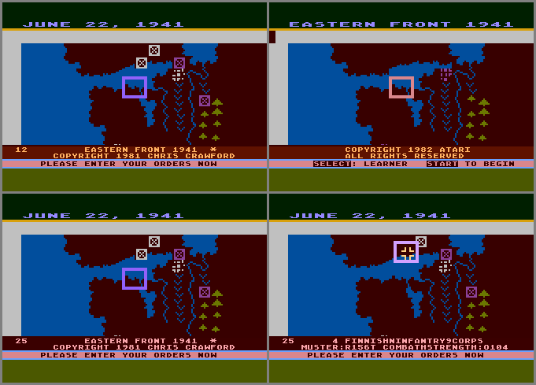

A random walk down the Eastern Front
===

<!-- markdownlint-disable MD033 -->

As mentioned in the [intro](../README.md),
I got bitten by an urge to understand how the game's AI worked
after discovering the APX source code.
This led to a [maze of twisty little passages][cca] which
I escaped only after rebuilding a browser-based redux of the game.

[cca]: https://en.wikipedia.org/wiki/Colossal_Cave_Adventure

The basic mechanism of the AI is surprisingly simple
and well explained in Crawford's [source code notes](howitworks.md),
though it's still hard to imagine debugging and tuning it in 6502 assembler.
He does mention prototyping in BASIC but still...
There's definitely much more complexity than any assembler I've written: respect!
The AI is clearly optimized for Russian defense, with no understanding of local combat tactics
like envelopment of leveraging ZoC.
After unfairly asking it to play against itself the Germans definitely come off worse (below).
One of my hopes for the project is that it motivates someone to experiment with new
computer player techniques.


Besides the AI&mdash;which is well documented by Crawford himself&mdash;there
are many elegant touches in the code.
The supply check is a great example:
units must trace a path to their home board edge unobstructed by zone of control.
Rather than an (expensive) exhaustive search for such a path
the game implements an efficient random walk.
Units try to trace directly
towards the target and divert in a random direction if blocked.
A unit is considered out of supply if their path is blocked more than a
weather and player-dependent threshold.

"Fog of war" is another great example.
A new feature for the cartridge, it obscures enemy strength
for units based on how long they've been out of contact.
Each turn, the game shows a randomized estimate of these units' strength
which needs to be constant throughout the turn,
with compatible combat and muster strength.
The game achieves this in just a handful of bytes using
a repeatable hash seeded by the turn and unit number indexed
into a block of game code(!) to create pseudo-random noise in the range &plusmn;2<sup>*k*</sup>.
The fog strength *k* is incremented or decremented each turn
depending on whether the unit is in enemy ZoC.
I also love the spiral walk to check zone of control itself.

As Crawford mentions, you'll see many examples of trickery to reduce
the game's memory footprint, including static data-structures whose ends overlap,
or tables offset from a phantom address because they're only used for one player.
This occurs often in the AI where tables are managed by unit index but only
used Russians so are based 55 bytes before the actual target data range.

APX &rarr; Cartridge
---

I didn't initially realize that the APX source code I'd found
was different than the cartridge I remembered playing.
When I discovered there were (at least) two [different versions][variants],
I naively assumed my learnings from the APX code would quickly translate to the cartridge.
However the [APX binary][apxbinary] and [cartrige binary][cartbinary]
are very different, with significant regorganization and rewriting having occurred.
Reverse-engineering the cartridge from an unannotated binary image
and correlating back to the routines and symbols in the APX code
became a project in itself.
One trivial example: I hesitate to admit how long it took
to realize that the cartridge had replaced the APX's "divide by repeated subtraction"
approach with a clever [29-byte division routine][divide].

[variants]: https://www.digitpress.com/eastereggs/a48easternfront.htm
[apxbinary]: http://www.atarimania.com/game-atari-400-800-xl-xe-eastern-front-1941_1791.html
[cartbinary]: http://www.atarimania.com/game-atari-400-800-xl-xe-eastern-front-1941_5986.html
[divide]: https://github.com/patricksurry/eastern-front-1941/blob/main/reference/cartridge.asm#L1863

<p align="center"></p>

Other changes included extensive refactoring with more subroutines;
multiple difficulty levels (replacing the simple handicap) and choice of start dates;
air units (Flieger) which support front-line combat units;
new movement modes for expert level (standard, assault, forced march, entrench);
"fog of war" obscuring enemy strength (above);
several bugfixes; and numerous logic, display and map tweaks.
For example, the APX version allows the attacker to strike the defender
even if it breaks as the result of the defender's strike whereas the
cartridge skips it.
Russians also get a muster strength boost in the APX code if they're in supply,
which the cartridge removes.

A little digital archaeology provides a good illustration of how the code evolved over time.
Combat unit types are represented in the order-of-battle with a single flag byte
which encodes their descriptor (high nibble) and base unit type (low nibble).
Each column of the chart below compares the APX encoding (left) and cartridge (right)
showing how these evolved, including changes that went unused in the shipped APX code.
The APX descriptor included unused labels for 'Mountain' and 'SS' units
which the cartridge replaced with the player-specific unit size 'Corps' and 'Army'.
The flags were reorganized in the cartridge
so that bit positions correspond to the unit kinds infantry, armor and air
which are used to index the movement charts (air behaves like armor).
In the process it discards the unused APX 'Shock' and 'Paratroop' types
and replaces them with 'Panzergrenadier' with 'Flieger'.
The high bit of the flag byte indicates the player,
with bit 4 (high bit of second nibble) unused.

<pre>
                  High nibble                            Low nibble
        Bits    APX         Cartridge     |    Bits    APX         Cartridge    Type
        ------------------------------------------------------------------------------
        0000                              |    0000    INFANTRY    INFANTRY   infantry
        0001   ~SS~         [CORPS]       |    0001    TANK        MILITIA    infantry
        0010    FINNISH     FINNISH       |    0010    CAVALRY     [MUSTER]   [air]
        0011    RUMANIAN    RUMANIAN      |    0011    PANZER      FLIEGER    air
        0100    ITALIAN     ITALIAN       |    0100    MILITIA     PANZER     armor
        0101    HUNGARAN    HUNGARIAN     |    0101   ~SHOCK~      TANK       armor
        0110   ~MOUNTAIN~   [ARMY]        |    0110   ~PARATRP~    CAVALRY    armor
        0111    GUARDS      GUARDS        |    0111    PZRGRNDR    [COMBAT]   [armor]
        1... Flag Russian(1) vs German(0) |    1... (Unused)
</pre>

Useful tools and resources
---

As I began comparing the [APX disk image][apxdisk] to the scanned source code listings,
and later to the binary cartridge image, I realized the need for disassembly tools which could
incrementally add symbolic labels and comments as I unravelled the code.
I discovered Ingo Hinterding's [pydisass6502][6502dis] which I ended up modifying extensively
for my requirements.
I also relied heavily on the [Atari 400/800 technical reference][atariref]
and an [Atari memory map][atarimap]
which I partially incorporated in my fork of [pydisass6502][6502pds].
Along the way I used various emulator tools like [my fork][py65pds]
of Mike Naberezny [py65][py65] and
Nick Morgan's [easy6502][6502sim]
to understand some of the more gnarly code fragments,
like the cartridge's new integer division routine :facepalm:.
Later I found [atarimac][atarimac] invaluable for debugging actual game play
with the cartridge binary.

[apxdisk]: ../reference/APX20050.ATR
[6502dis]: https://github.com/Esshahn/pydisass6502
[6502pds]: https://github.com/patricksurry/pydisass6502
[atariref]: http://data.atariwiki.org/DOC/Atari_400-800_Technical_Reference_Notes-Operating_System_User_s_Manual-Operating_System_Source_Listing_and_Hardware_Manual_553_pages.pdf
[atarimap]: https://www.atariarchives.org/mapping/memorymap.php
[py65pds]: https://github.com/patricksurry/py65
[py65]: https://github.com/mnaberez/py65
[6502sim]: https://skilldrick.github.io/easy6502/
[atarimac]: https://www.atarimac.com/atari800macx.php

Fonts
---

The original game uses Atari's builtin [atascii][atascii] font for text,
two custom 64 character fonts to display the northern and southern parts of the map,
as well as custom sprite characters for the movement arrows and [maltakreuze][maltakreuze].
The game dynamically changes the foreground and background colors as the seasons change
and to distinguish Russian from German units and cities.
The images below show all the characters used in the APX and cartridge versions respectively,
with the builtin characters in the top half, the custom map characters in the bottom half
(note the trees vs mountains and differences in river and coastline shapes),
plus the extra sprite characters at the bottom.
The cartridge version (right) drops one coastline character in favor of the new Flieger unit.

<p align="center">
    
    &nbsp;&nbsp;
    
</p>

An early challenge was to preserve that look in a browser using HTML, SVG and/or CSS.
After a few false starts, I discovered I could use an image with transparent background as a CSS `mask-image`
to cut from a square filled with foreground color, and stack that on a square filled with background color.
Thus each character is a `div.chr` containing a `div.fg-chr` atop a `div.bg-chr` as shown below.
We cut out the character we want by masking with a single image sprite containing all the characters
and setting an appropriate `mask-position`.

<p align="center"></p>

I started building the display layer using [D3][d3js] but later switched to [Mithril][mithril]
whose declarative style is much cleaner to manage in an MVC model.
That led to abstracting an VT-like terminal window in
`src/antic` including very simple formatting escape codes for
setting text layout, colors and so on.
The game display is then composed of several such terminal windows which are
managed independently by the app controller.
Even the map (below) is just a stack of oversized (and scrollable)
terminal windows displaying different layers of information including terrain,
(optional) city labels, units, selection masking and so on.

I'm still a little confused about the [Atari color scheme][ataripalette].
There seem to be many alternative palettes floating around but only a couple
seem playable.  You can experiment by changing `config.ts:options.colorPalette`
to point at any of the palettes defined in `src/antic/palettes.ts`.

[d3js]: https://d3js.org/
[mithril]: https://mithril.js.org/
[ataripalette]: https://en.wikipedia.org/wiki/List_of_video_game_console_palettes#Atari

Map
---

The [original map][apxmapdata] is stored as 8-bit binary data with one byte per map square.
The lower six bits index into either the custom north or south font based on the square's latitude,
with the two upper bits choosing the color channel.
(The cartridge goes an extra step to save some space with a
[custom run-length coding][maprle] but unpacks to essentially the same thing.)
Including the raw map data as a base64'd binary blob or whatever seemed like a cop out,
so I took a detour to re-encode using a custom base65 mapping
where each terrain type maps to a group of related printable characters:
space for clear, numbers for trees/mountains, upper and lowercase letters for coastlines and rivers respectively, and so on.
That makes the [javascript map data][jsmapdata] much more accessible and (if we're careful) even editable?!

[maprle]: https://github.com/patricksurry/eastern-front-1941/blob/main/reference/cartridge.asm#L3520-L3555

<p align="center"></p>

> TODO: side-by-side to show diff between APX and cartridge version

[atascii]: https://en.wikipedia.org/wiki/ATASCII
[maltakreuze]: https://en.wikipedia.org/wiki/Maltese_cross
[apxmapdata]: https://github.com/patricksurry/eastern-front-1941/blob/main/reference/apxdump.asm#L1527
[jsmapdata]: https://github.com/patricksurry/eastern-front-1941/blob/main/src/engine/map-data.ts

Extras
---

Along the way I made a few minor additions to improve playability and make it easier
for me to test the implementation.
These include designing interaction around the keyboard with optional mouse selection
rather than a joystick and a help screen toggled by `?`.
The `z` key toggles a 2x zoom to show more of the battlefield but tries to keep the spirit of the scrolling map rather than, say, adding a floating minimap.
Several other display changes are toggled by the `x` key:

- show the currently ordered path for each unit
- unit overlays with a health bar showing muster and combat strength;
  a movement mode indicator in expert mode,
  and a supply / new arrival indicator
- show selected unit's maximum reach based on terrain, weather and movement mode
  but ignoring other units
- hover text showing unit and terrain information
- the `g` key extends these to enemy units which is cheating unless you're debugging :-)

I made other less visible changes,
perhaps most notably switching from the Atari's truly random byte generator
to a simple predictable [linear feedback shift register][lfsr] generator.
The generator is normally seeded randomly on game start but
means that turn resolution is completely deterministic given each player's
orders and the current state of the generator.
This greatly simplifies debugging and unit testing.

[lfsr]: https://en.wikipedia.org/wiki/Linear-feedback_shift_register

The other significant change is that the AI now uses [A<sup>*</sup>][astar]
path-finding and takes terrain costs into account when deciding the
best orders to get each unit where to where it wants to be.
This would have been a significant extra compute overhead on a 6502 AI.
The original code used a version of [Bresenham's][bresenham] algorithm
which is much cheaper to compute but results longer transit times
and (in some cases) to units getting stuck.

[astar]: https://www.redblobgames.com/pathfinding/a-star/introduction.html
[bresenham]: https://en.wikipedia.org/wiki/Bresenham%27s_line_algorithm

I also added the current game state to the browser URL,
updated each time the player modifies their orders (AI orders are not represented),
and whenever a turn is resolved.
This makes it easy to save or share a game,
perhaps to compare favorite openings or track down a bug.
For the latter purpose the game also logs the current state to the browser console
prior to resolving each turn.
These states can be copied using the browser developer tools
in order to replay from where things went wrong.

Side note: I spent rather too much time on making the state token in the URL compact.
Rather than a simple base64 reprsentation,
we first represent all game state as a list of integers,
and then use a variety of integer coding methods
([zigzag][zigzag], [run-length][rle] and [Fibonacci][fib] encoding)
before representing the compressed bit-string as a custom base65 ascii string.
See `src/engine/codec.ts` for the gory details.
This was definitely overkill, but also fun, and on the positive side it
reduces the token size by a little more than half compared to base64.

[zigzag]: https://stackoverflow.com/questions/4533076/google-protocol-buffers-zigzag-encoding
[rle]: https://en.wikipedia.org/wiki/Run-length_encoding
[fib]: https://en.wikipedia.org/wiki/Fibonacci_coding

I tried to capture other changes and implementation decisions I was unsure about
in the `src/config.ts` as options.
Largely these are small changs like making retreat and supply checks slightly
more random, rather than considering north and south in a fixed order;
and tweaking some AI calculations to improve symmetry or efficiency.
For more see the notes in [how it works](howitworks.md).

Bugs and mysteries
---

There are always loose ends and unexplored avenues with a project like this.
Here are a few clues that might reward further study:

- the Expert'42 scenario in the original cartridge seems to have a bug where one or
  both Finnish units fail their initial supply check.
  Stepping through with a debugger seems to show that [TERRB][terrb]
  reports an enemy unit in one of the top left offboard locations adjacent to the boundary.
  Perhaps related to the notch that shows there?
- It's curious that Sevastpol appears as a scoring city in the APX code
  ([MOSCOW][moscow]; [MOSCPTS][moscpts]) but isn't represented as a city
  on the map in either version?
  It also has special behavior in the cartridge where a militia unit stationed there
  automatically recovers to full strength each tick,
  representing the "nearly impregnable fortress" there.
  I reinstated it on the map but didn't allocate points.
- The [Opponents Undaunted (p32-33)][cpw120] piece from Computer Gaming World
  refers to a bug where
  "Russian units would advance into better positions during the retreat phase".
  I haven't gotten to the bottom of that one.
- In the APX version it looks like it's possible to freeze the Kerch straits given the right
  combation of random choices, but that might be a misinterpretation on my part.
- The [TERRTY][terrty] check in the cartridge should shift the estuary check down by one
  given the font shifts over by one to accomodate the Flieger unit.
- On each new turn, the cartridge verifies that a 256 byte checksum of the NEWTRN routine
  results in `#$8e`, otherwise it seems to resurrect the last defender?
  This seems odd in a ROM routine but perhaps it was a debugging entrypoint, now a no-op?

```asm
    _NXTTRN_1:  clc                              ; be28 18
                adc NEWTRN,x                     ; be29 7da7bb
                inx                              ; be2c e8
                bne _NXTTRN_1                    ; be2d d0f9
                cmp #$8e                         ; be2f c98e    Checksum of 256 bytes from NEWTRN is 8e, but why check ROM?
                beq _NXTTRN_2                    ; be31 f005
                ldx DEFNDR                       ; be33 a6ad
                jsr SETSWTCH                     ; be35 2081bf  . SETCHYX and SWITCH
    _NXTTRN_2:  ldx #$a6                         ; be38 a2a6
```
- there's an APX bug that's later fixed in the cartridge where the defender's strength
  is indexed incorrectly.  It starts in the APX code as:

```asm
            jsr SWITCH      ; 4f23 20ef79  replace original unit character
            ldx DEFNDR      ; 4f26 a6c4
            pla             ; 4f28 68
            sta SWAP,x      ; 4f29 9d7c56  . terrain code underneath unit
            jsr TERRTY      ; 4f2c 206973  . convert map chr in TRNCOD -> TRNTYP, also y reg
            ldx DEFNC,y     ; 4f2f beb479
            lda CSTRNG,y    ; 4f32 b9dd55  <= indexing OoB via terrain type instead of defender?
            lsr             ; 4f35 4a      adjust for terrain, max 255
_COMBAT_5:  dex             ; 4f36 ca
            beq _COMBAT_6   ; 4f37 f005
            rol             ; 4f39 2a
            bcc _COMBAT_5   ; 4f3a 90fa
            lda #$ff        ; 4f3c a9ff
_COMBAT_6:  ldx HMORDS,y    ; 4f3e be755d  now adjust for defender's motion [y still wrong?]
            beq DOBATL      ; 4f41 f001
            lsr             ; 4f43 4a      penalty if moving
DOBATL:     cmp  RANDOM     ; 4f44 cd0ad2  evaluate defender's strike
```

and later becomes the cartridge code:


```asm
            ldx DEFNDR       ; ad02 a6ad
            jsr SETSWTCH     ; ad04 2081bf  SETCHYX and SWITCH
            pla              ; ad07 68
            sta SWAP,x       ; ad08 9d8331  terrain code underneath unit
            jsr FLGRBRK      ; ad0b 2028ae  Fliegerkorps break and suffer 75% loss
            jsr TERRTY       ; ad0e 20c8b8  convert map chr in TRNCOD -> TRNTYP and y, LAT -> x
            ldx DEFNC,y      ; ad11 be71a0
            lda LEVEL        ; ad14 a592    Level learner/beginner/intermediate/advanced/expert
            cmp #$04         ; ad16 c904
            bne _COMBAT_5    ; ad18 d001
            inx              ; ad1a e8      Double defense in expert mode
_COMBAT_5:  ldy DEFNDR       ; ad1b a4ad
            lda CSTRNG,y     ; ad1d b92b32  <= combat strength fixed
            lsr              ; ad20 4a
_COMBAT_6:  dex              ; ad21 ca
            beq _COMBAT_7    ; ad22 f005
            rol              ; ad24 2a
            bcc _COMBAT_6    ; ad25 90fa
            lda #$ff         ; ad27 a9ff
_COMBAT_7:  ldx HMORDS,y     ; ad29 bed232  how many orders queued for each unit
```

[terrb]: https://github.com/patricksurry/eastern-front-1941/blob/main/reference/cartridge.asm#1716
[terrty]: https://github.com/patricksurry/eastern-front-1941/blob/main/reference/cartridge.asm#L3459
[moscow]: https://github.com/patricksurry/eastern-front-1941/blob/main/reference/apxdump.asm#L2150
[moscpts]: https://github.com/patricksurry/eastern-front-1941/blob/main/reference/apxdump.asm#L2382
[cpw120]: https://www.cgwmuseum.org/galleries/issues/cgw_120.pdf
