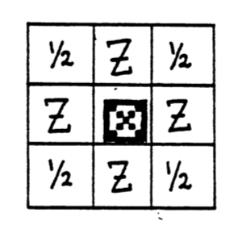
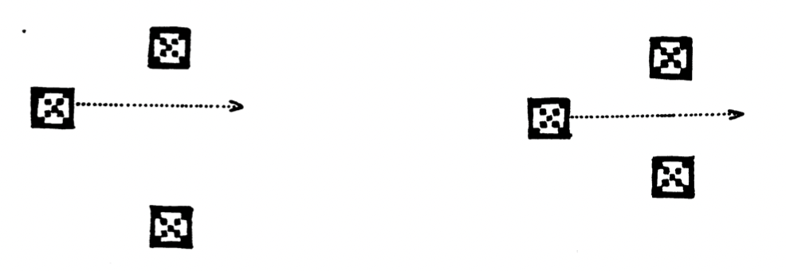
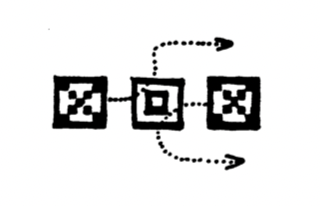
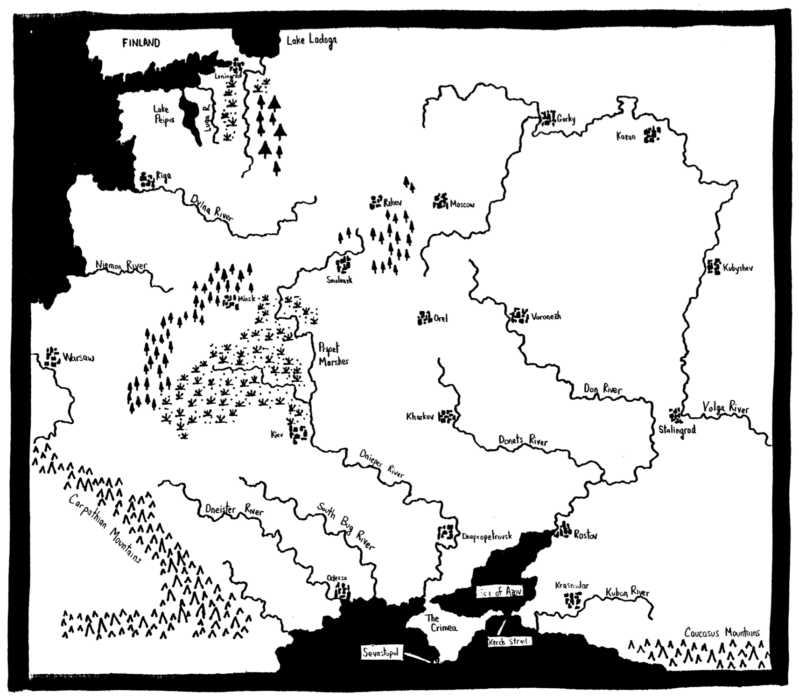

- link the map poster

INTRODUCTION
===

EASTERN FRONT 1941 Is a simulation of Operation Barbarossa, the German
Invasion of Russia during World War II. The campaign that this Invasion
started lasted nearly four years and swept away perhaps 20 million lives.

You play the part of the German commander, maneuvering your combat units to
obtain a good position before the winter sets in and the Russian
counteroffensives begin. The game is played on an ATARI 400™ or ATARI 800™
Personal Computer System with an ATARI 410™ program recorder or an ATARI 810™
disk drive. The cassette version requires at least 16K of RAM; the diskette
version requires at least 32K of RAM.

This ts an exceptionally complex game. You should read this manual
thoroughly before attempting to play the game. If you try to play the game
before you have digested the rules, you will probably become confused and
frustrated. If you are new to wargames, you may find some of the concepts
strange. All of the factors in the game have been put in for good reasons;
the game really does make sense. If you go through the trial run, read the
explanations and think them over, you will have a more enjoyable and
rewarding experience than you would have by just grabbing a Joystick and
starting to play.

<table><td>
    :information_source: This is a warning. You play the part of the German commander, maneuvering your combat units to
obtain a good position before the winter sets in and the Russian
counteroffensives begin. The game is played on an ATARI 400™ or ATARI 800™
Personal Computer System with an ATARI 410™ program recorder or an ATARI 810™
disk drive. The cassette version requires at least 16K of RAM; the diskette
version requires at least 32K of RAM.
</td></table>

<table><td>
    :warning: :construction:  :round_pushpin:  :no_entry: :white_check_mark:
    :point_right: :eyes:  :bulb:  :pushpin:
:new: You play the part of the German commander, maneuvering your combat units to
obtain a good position before the winter sets in and the Russian
counteroffensives begin.

The game is **played** on an ATARI 400™ or ATARI 800™
Personal Computer System with an ATARI 410™ program recorder or an ATARI 810™
disk drive. The cassette version requires at least 16K of RAM; the diskette
version requires at least 32K of RAM.

</td></table>

LOADING THE PROGRAM
===

If you have the cassette version, remove any program cartridges from the
computer and slide the cassette into the program recorder. Rewind it to the
beginning, then press PLAY. Hold down the START button on the console and
turn on the computer. The console speaker will sound once. Release the
START button and press RETURN. The program will automatically load and run.

If you have the diskette version, turn on the disk drive and insert the
diskette. Remove any program cartridges from the computer and turn on power
to the computer; the program will automatically load and run.

It is essential with both versions of this program that you start with
the computer turned off and with no program cartridges in place. Once the
program begins, you may find the colors more appealing if you turn up the
brightness control on your television set or monitor.

TRIAL RUN
===

We shall begin with a trial run to familiarize you with the mechanics of
the game. Plug a Joystick into port 1 and you are ready for the trial run.

TOURING THE MAP
===

You will see a map of a portion of Russia. In the center of the map is
@ square pink cursor. (Because of adjustment differences between different
televisions, colors on your television set may not be the same as in this
description.) Manipulating the joystick will cause the cursor to move. When
the cursor bumps into the edge of the screen, the entire map image will
scroll to reveal other portions of the map. The white boundary marks the
edge of the map. Wander over the map to familiarize yourself with the
terrain. Some symbols are not immediately obvious. Swamps are marked by a
group of blue v-shaped symbols. Cities are white arrays of tiny rectangles.
Mountains are orange triangles. Military units come in two shapes and two
colors. Squares with x's in them indicate infantry units. Squares with
smaller squares inside them (they are supposed to be ovals) indicate armored
or cavalry units. Red units are Russian; white units are German or German
allies. A map of the entire theater of operations is included at the end of
this manual.

INSPECTING UNITS
===

Place the cursor on any unit and press the red Joystick button. The
unit will disappear, revealing the terrain underneath it. The cursor will
light up to indicate that you have a unit in the cursor. Vital information
on the unit will appear in the dark orange text window at the bottom of the
screen. The unit's designation will appear on the upper line; its strength
will appear on the lower line. There are two measures of strength. The
first is muster strength, which measures how many men, tanks, and guns the
unit has. The second is combat strength, which measures how effectively
these resources can be brought to bear in battle. There is a difference
between the two because no military organization operates perfectly in the
shock of battle. The chaos and crisis of combat will generate confusion
within the organization which will prevent it from fully deploying al! of its
strength. Loss of supplies can have a similar effect. The combat strength
of the unit measures how much of the unit's military potential can be brought
to bear by the commander.

The unit's designation is provided for purposes of historical color
only. It does not affect the play of the game in any way. The unit type
(infantry, militia, armor, panzer, or cavalry) is significant to the play of
the game. Infantry or militia units (shown as a square with an X) move more
slowly than armor, panzer, or cavalry units (shown as a square with a smaller
square inside). The unit strengths are measured in arbitrary units which
cannot be directly related to the absolute numbers of men, tanks, or guns.

GIVING ORDERS
===

If the unit is a German unit, a yellow cross appeared underneath the
unit when you pressed the red button. This cross is the Maltakreuze, or
maltese cross, and has been a symbol of the German nation for many years. In
this game, the Maltakreuze marks the current objective of a German unit.

While still holding down the button, press the joystick in any direction
(except diagonal). You will hear a feedback beep and the Maltakreuze will
move one step in the direction indicated by the joystick. Release the
Joystick and the beep will stop. You have Just given one order to that unit.
A green arrow will appear at the unit's location and will travel to the
Maltakreuze, thereby indicating the path that the unit will take. You can
add more orders by pressing the joystick in another direction, or the
original direction, and releasing it after each order. Each time you do, the
Maltakreuze will step in the direction you indicated. You can enter a
maximum of eight orders for each unit. If you try to add more, a nasty buzzer
will sound and an error message will appear in the yellow text window. If
you release the red joystick button, you must wait for the Maltakreuze to
appear before you can add more orders. If you make a mistake in giving
orders, you can erase your existing orders by pressing the space bar on the
keyboard while the red button is depressed. The Maltakreuze will return to
the location of the unit in the cursor and you can start over.

EXECUTING ORDERS
===

Give orders to several units in the same vicinity; when you are done
press the START button and watch them closely. The computer will execute the
orders you have given your units. It will attempt to move them according to
the rules of movement. If a unit attempts to enter a position held by an
enemy unit, the computer will resolve the resulting combat according to the
rules of combat. Whenever a battle occurs, the computer will make a gunshot
sound. The many battles fought during movement execution will generate a
sound rather like a machine gun. The computer will also flash the defending
unit in solid color. Thus, you can hear and see the process of combat.

NEW TURN SEQUENCE
===

Once the move is completed, the computer takes about three seconds to
perform a variety of calculations related to the passage of time. It updates
the date message at the top of the screen and figures the passage of the
seasons. It brings any reinforcements onto the map and adds replacements to
units already on the map. It figures logistics and imposes penalties on
units which are out of supply. It figures your current point score and posts
it on the upper left corner of the dark orange text window. Finally, ft
notes if you have any reinforcements this turn; if so it places an asterisk
in the upper right corner of the dark orange text window to remind you. When
it is done, it will prompt you to begin entering your orders for the next
turn. The game proceeds until March 29, 1942, when your performance [s
evaluated and you are assigned a score.

This completes the trial run. Now read the rest of this manual before
playing your first real game of EASTERN FRONT 1941. The rest of this manual
is devoted to discussing in detail each of the major subsystems of the game.
Each topic is introduced with an explanation of the historical background for
that section of the rules.

MOVEMENT
===

Historical Background
---

Movement is just as important a component of modern war as firepower.
Napoleon's adage, "impact equals mass times velocity", is still true.
Indeed, the "Blitz" in Blitzkrieg refers to the speed of motion of the
attacking units. Thus, the primary effort in any general's job is figuring
out how to move all the troops as quickly as possible. Numerous factors make
this job difficult. First, many geographic factors combine to slow the
troops down. The open steppes were excellent places for high-speed
maneuvers, but swamps, rivers, mountains, and forests all slowed the units
down. Second, weather could have a serious impact on the mobility of the
combat units. Third, traffic jams often developed which tied up thousands of
troops in gigantic snarls. Fourth, movement is simultaneous, meaning that
orders given on one day may not work when they are executed. The general
must somehow prepare his orders with all these factors in mind.

Mechanics
---

Movement is executed by a process that simulates real-time motion. Each
turn is divided into 32 subturns. A unit which is ordered to move into a
square does not do so immediately; instead, there is a delay of several
subturns before it does so. The amount of delay depends on the terrain being
entered, the type of unit, the season, and the presence of other units.

Open sea provides the longest delay, so long that no unit will ever
enter an open sea square. Swamps provide the next longest delay. Next come
rivers and coastline squares. Then come forests and mountains. Cities
impose only a small delay and clear terrain offers the least delay. Units
may not cross narrow sections of sea or lakes. The exception to this rule is
the crossing at the Kerch Straits, connecting the Sea of Azov with the Black
Sea. Units can cross there.

Armored units move faster than infantry units, except during mud season.
Russian militia units cannot move of their own accord. They can retreat
normally but cannot attack or move on their own.

ZONES OF CONTROL
===

Historical background
---

The standard unit in this game, the corps for the Germans and the army
for the Russians, would typically have thirty to fifty thousand men in it.
However, if you were to fly over the unit on the battlefield, you would not
see 50,000 men congregated together in a large mass. Instead, you would see
many of the troops occupying the front lines, with a smaller number behind
the lines acting as local reserves. Thus, the strength of the unit would be
stretched out in a long line. Depicting this on a wargame map is difficult.
The only way to accurately do it is to stack up lots of units shoulder to
shoulder. There would be too many units for one person to control in any
reasonable way. Wargame designers have developed a solution to this problem
called the Zone of Control. The Zone of Control is a region surrounding a
unit which restricts the motion of enemy units. You might imagine it to be
like a force field around a unit. It is supposed to represent a portion of
the unit spread out into nearby squares. Its real purpose is to keep the
number of units in the game down to a reasonable level.

Mechanics
---

No unit can enter a square already occupied by a friendly unit. If a
unit finds that its orders would take it into a square already so occupied,
it politely waits until the blocking unit vacates the square.

The motion of units is hampered by the existence of zones of control
created by enemy units. Each unit exerts a zone of control into the squares
around it as shown [n the following diagram:

A square marked Z has a zone of control; a square marked 1/2 has a zone of
control only if another nearby friendly unit casts at least a half zone of
control into it. A unit's motion is affected by enemy zones of control only,
not by friendly zones of control.

No unit may move from one enemy controlled square to another enemy
controlled square (exception: see combat discussion). Units may move into or
out of enemy controlled squares freely, so long as they do not move directly
from one enemy controlled square to another. For example, the movement shown
on the left is legal, but the movement shown on the right would not be
allowed.

COMBAT
===

Historical Background
---

Combat on the Eastern Front on the scale of corps and armies normally
took one of three avenues. Sometimes it was nothing more than a bloody
bashing match in which thousands died but neither opponent was badly enough
damaged to give way. This was particularly frequent with Russian attacks.
German attacks would frequently pierce the Russian unit and the Germans would
pour through. German tactical skill played as much a part in this as Russian
blundering. The third type of resolution obtained came infrequently at this
stage of the war: the Russians would attack with such overwhelming strength
that the German defenders would be crushed. In all types of battles, the
Germans demonstrated better group cohesion than the Russians. They stood up
and stayed fighting under conditions which would have precipitated collapse
in their Russian counterparts. This was an important element in the early
successes of the German army.

Mechanics
---

Combat occurs whenever a unit attempts to enter an enemy occupied
square. This triggers a series of small battles. In each small battle, each
unit attempts to inflict losses on the other. The probability that a unit
will succeed in inflicting losses on its opponent is proportional to its
combat strength. This probability is affected by terrain. Units defending
in forest, mountains, or cities enjoy a defensive bonus. Units attacking
from a river square suffer a penalty. The probability is also affected by
the motion of the defender. Stationary defenders put up a better fight than
moving ones. If the attempt to inflict losses succeeds, the opponent's
muster strength is reduced by 1 and its combat strength is reduced by 5.

Both units continue to slug it out until either the turn ends or one unit
breaks. A unit breaks when its combat strength falls below its threshold for
breaking. For German units this threshold is one half of the muster
strength; for all other units the threshold is three quarters of the muster
strength. Thus, German units can stand up and fight for longer than other
units.

When an attacking unit breaks it simply stops attacking. When a
defending unit breaks it must retreat. No unit may retreat into another
unit, enemy or friendly. Furthermore, no unit may retreat into an enemy zone
of control. A retreating unit first attempts to retreat directly away from
its attacker; if the path is blocked it tries to go to the side. It loses 5
combat strength points each time its path is blocked. If the defender
retreats, the attacker immediately advances into the defender's square. This
happens regardless of the presence of enemy zones of control. If at any time
a unit's combat strength reaches zero, the unit is destroyed and removed
permanently from the map.

Units reorganize themselves automatically, thereby recovering combat
strength. If no other processes act to deplete its combat strength, a unit
will eventually recover all of its combat strength up to the limit of its
muster strength. The rate of recovery depends on the muster strength of the
unit. Large units will recover combat strength faster than small ones.
Finnish units cannot attack; they defend normally.

The purpose of these rules is to emphasize the organizational aspect of
warfare over the brute force aspect. A simple frontal assault will only
cause some small losses on both sides without achieving decisive results.
However, by concentrating a great deal of power on a single enemy unit, the
unit can be pushed below its threshold in a single turn. The losses it
suffers when it breaks will be much higher than the losses that could be
inflicted by simple firepower. Furthermore, if the unit can be surrounded or
otherwise denied a retreat route, it can be annihilated with far less effort
than a simple frontal push. The emphasis is thus placed on maneuver (for
surrounding) and concentration (to break the unit).

LOGISTICS
===

Historical Background
---

Modern war depends on the prompt provision of large quantities of
materials for the fighting troops. The amount of supplies consumed by an
army is truly staggering. A typical German corps during this period required
about 150 tons of supplies every day. Supplies included ammunition, food,
fuel, clothing, weapons parts, and medical supplies. Of these, ammunition
was normally the largest portion. A single artillery piece can shoot off a
ton of shells in a few minutes. A machine gun can run through 50 pounds of
ammunition in the same time. It is easy to see then that supplies are vital
to the combat effectiveness of any modern army.

Mechanics
---

Supplies are provided automatically to every unit which can trace a
supply path to its edge of the map (exception: see Seasons). The Russian
supply source is the east edge of the map. The German supply source is the
west edge of the map. A supply path is traced by starting at the unit and
heading straight for the map edge. The supply path is not affected by
terrain, except open sea. The supply path can be blocked by enemy units or
enemy zones of control. However, enemy zones of control are negated by the
presence of friendly units for the purpose of evaluating supply. The path of
supply need not be a straight line; it can bend around intervening blockages.
However, it cannot twist and turn too much. When a unit's path of supply is
threatened by enemy units in its rear, the evaluation of supply has a small
random element in it. Thus, in tricky situations it is not possible to know
precisely whether a unit will get supplies. Russian units cannot trace
supply across open sea; German units can. Russian supply lines can be more
convoluted than German supply lines.

Supply paths are traced and evaluated at the beginning of each weekly
turn. The process takes about three seconds, during which time you cannot
enter orders. Russian units in supply will get replacements to augment their
muster strength, amounting to two additional muster strength points per turn.
German units and any Russian units that are out of supply get no
replacements. Units out of supply have their combat strength cut in half.
If a unit remains out of supply for several turns, the cumulative result of
loss of supply can be devastating but not sufficient to destroy the unit.

SEASONS
===

The character of the war changed dramatically as the seasons changed.
During the dry summer season, the Germans could take full advantage of their
superior mobility and flexibility to wreak great destruction on the Soviets.
When the mud season arrived in October, the German vehicles were mired and
the German armies ground to a halt. Later, when the winter started, the
Germans were back in business. Their successes in early winter soon
evaporated as the temperature fell. The soldiers froze and the equipment
malfunctioned.

Mechanics
---

To simulate the effects of the Russian weather, certain seasonal effects
have been added. There are three seasons, each indicated by a ground color.
Summer season is indicated by brown ground. Mud season is indicated by grey
ground. During mud, all movement and combat slow to a crawl. All German
units lose supply. Thus, not much happens during mud season. This gives
both sides a chance to catch their breaths. Of course, time is working in
the Russians! favor, so mud is ultimately a bad time for the Germans. Winter
is indicated by white ground. During winter, mobility is better than in mud
season but not as good as [n summer. German units which can trace supply
lines might nevertheless lose supply. This is meant to simulate not only the
supply situation but also the precipitous-drop in combat efficiency that the
Germans experienced when the winter set in. Supplies did get through, but
engines froze, guns jammed, and men suffered frostbite. The effect on combat
strength was approximately the same as a loss of supplies. The farther east
a German unit is, the smaller the chance that it will get supplies.

END OF GAME
===

The game lasts until March 29 1942, which its the 41st turn. The score
you have reached on that turn (which is posted in the upper left corner of
the orange text window) is your final game score. Victory points are earned
by projecting as much muster strength as far to the east as possible.
Victory points are lost for allowing the Russians to push combat strength to
the west. Thus, maximum victory points are gained by moving as many muster
strength points as far to the east as possible, while destroying as many
Russian combat strength points as possible and pushing the remainder to the
east. In addition, capturing and holding Moscow gains you 20 points.
Leningrad, Stalingrad, and Sevastopol are each worth 10 points.

The highest possible score is 255 points. It is not difficult to
achieve this score during the course of the game but it is very difficult to
maintain it right to the end of the game. The game has been playtested many,
many times, but we do not know if our playtester's scores are representative
of the scores that you might earn. Our own experience is that any score
above 200 is excellent, while a score between 100 and 200 is very good. From
50 to 100 is good, and less than 50 points is not so good. Scores of 0 are
not uncommon. This is a difficult game.

HANDICAP
===

There is a handicap provision for beginning players. If you press the
OPTION key at any time, your troops will have their muster strength increased
by 50%. It is best to exercise this option immediately upon beginning the
game. This will give you a large handicap in your battles with the Soviets.
There is a penalty for using this handicap option: your score will be halved
if it is used. Therefore, I recommend you use this option only until you can
beat the Russians enough to capture and hold Moscow. Once you have been able
to take Moscow, refrain from using the handicap option. When you use the
handicap option, the text window will change color from a dark orange to a
tan color. This will remind you that you have used the handicap option. The
handicap option can be used only once during the course of a game.

RESTARTING THE GAME
===

There is no provision for restarting this game nor is there a provision
for saving the game for later retrieval. After all, the game takes about two
or three hours to play.

COMPUTER THINKING
===

The computer plans its move while you plan yours. It considers its
units one by one, plotting a move for each one. Initially the move it plans
is rather clumsy, but the more time you give it to work on the move, the
better the move will be. You should not try to hurry your move to give the
computer less time to think; with the computer working at 1.79 Megahertz the
odds are that you will be the only one to suffer from lack of time.

HINTS ON STRATEGY AND TACTICS
===

The basic flow of this game is very similar to the historic sequence of
events. The Germans sweep in, wiping out Russian armies right and left. But
the Russians keep fielding new armies and the Germans, depleted by a long
campaign, start to run out of steam as they approach Moscow. They reach
Moscow Just as the mud season sets [n but are unable to take it. When winter
starts they resume their offensive and make further gains but are unable to
achieve decisive results. Their rapidly fading strength and the growing
strength of the Russians combine to first halt their advance and then turn it
into a retreat. That's what should happen. The game does a fair job of
duplicating that performance.

The strategies required to do all this revolve around mobility and
concentration of strength. The armored units must be concentrated at weak
points in the Russian line. Once the line is breached, the armored units
must be poured through the hole without hesitation. After penetrating to the
Russian rear, they must turn to encircle the retreating Russian armies. In
so doing they will place both themselves and the Russians out of supply. The
Russians will frantically try to escape from the trap and will hurl
themselves at the beleaguered panzer corps. The deciding factor is the speed
of the German infantry corps. Will they be fast enough to destroy the
Russian armies before the Russians destroy the Panzers? If you handle your
armies with skill and nerve, you will succeed. Be careful not to get your
Panzer corps too far ahead of the infantry or they will be cut to shreds.

You cannot afford to lose any Panzer corps during summer. Do not attempt to
bite off more than, say, six Russian armies at a time. It is very difficult
to reduce a pocket with too many Russians in it.

Plan the paths of attack of your units carefully. Sloppy planning will
only produce traffic jams. You don't have time to sort out all the traffic
jams. Get the orders right in the first place. Mobility is your biggest
advantage over the Russians. Keep the army moving. Do not allow yourself to
be bogged down in frontal attacks. Find the weak spot and concentrate your
armor on it. When you have made a breakthrough, send one unit onto each
shoulder of the hole to pin the retreating Russian units. This will prevent
them from interfering with the deep penetration of the armored units.

Often you will cut off a single Russian army from the rest of the line.
Do not waste valuable troops mopping it up. Only two corps, one on either
side, will finish [ft off.

The Russian winter counteroffensive is a frightening experience. The
Russians look overwhelmingly powerful. They cannot be stopped. They can be
slowed. With good generalship, your losses can be minimized. Don't fight
for every inch of ground. Give ground as necessary. Keep a small mobile
reserve of armor. When a penetration occurs, send the armor to isolate the
penetrating unit. Cut off its supplies, starve it, then finish it off. This
mobile defence requires great skill but is very effective in slowing the
Russian steamroller. Don't be alarmed when your point score steadily falls
through the winter. This is the normal result of the Russian winter
offensives.

Remember the winter supply rule: the further east your troops are, the
fewer supplies they will get. You should plan to pull back your troops
during the winter to get better supplies. If a section of front is in
serious trouble, pull it back quickly. It will give the troops some time to
recover from the beating as well as giving them better supplies.

A final comment: this game is complex. In your first playing you will
probably botch it. Don't feel bad. It will take a while to learn the
techniques. Unlike an arcade game, this game requires a considerable
investment of your time and intellectual effort to master. The rewards for
this investment are correspondingly greater.

DESIGNER'S NOTES
===

There are a number of complaints levelled against this game design which
emerged during playtesting. The first complaint ts that the logistics rules
are wrong. The random element of supply rankles some players. Supply on the
Eastern Front was not a certain thing. Sometimes the supplies got through,
sometimes they didn't. If a unit has a straight path of supply, it will
certainly get supplies. Probability enters the picture in only two
situations: when the supply path becomes twisted and during winter.

Another complaint levelled against the game concerns the aggravation of
traffic jams. This is particularly irritating when two units attack a
surrounded unit. Typically they destroy their victim but crash into each
other. This prevents any further motion until their paths are straightened
out. After much consideration I decided to leave the traffic jams [n.
Traffic Jams were very much a part of Eastern Front combat. Besides, the
problem can be minimized with careful planning. For example, if you have a
Russian un!t surrounded from two sides, It is quite possible to give orders
that will work. The diagram illustrates the solution:

Having addressed the most obvious of the game's flaws I now turn to the
pleasant task of discussing the game's strong points. The graphics elements
are the most obvious. They are also the aspect of the game that I can take
least credit for. Designing graphics on this computer is like riding a
spirited horse---you loosen the reins and let it fly. Indeed, this game does
not utilize all of the graphics capabilities of the machine. The game does
not make use of one of the players, al! of the missiles, player/playfield
priorities and collision detection, four-color character sets, real-time
color register indirection, and dynamic display lists. Thus, it makes use of
only about 75 per cent of the graphics capability inherent in the machine.
Much learning lies in front of us before we can say that we have mastered
this computer.

I take great pride in the input/output structure of this game. The
joystick, graphics, and sound are integrated into a smoothly operating
System. I spent nearly a month designing this arrangement, and another month
implementing it. I wanted to design a game playable with only the joystick.
I failed; in the end there were those three buttons (START, OPTION, and SPACE
BAR) that the user must also use to play the game. Those were painful
concessions. Other game features were abandoned when I realized they could
not be implemented without recourse to more keystrokes. I refuse to design a
human engineering monstrosity.

The feature I am most proud of is the artificial intelligence the game
uses. It is a trifle presumptuous of me to call it artificial intelligence,
for the computer does not learn from its mistakes nor does it adjust its
strategies in direct response to the human's move. However, it does analyze
its position, it can recognize danger and opportunity, and it can react
accordingly. It avoids (but cannot prevent) traffic jams. It also
recognizes the combat value of terrain and plans its moves accordingly. The
computer plans [ts moves while the human works on his own moves; this is
accomplished with a vertical blank interrupt routine that separates the two
processes. in effect, the computer is executing a technique called
multitasking. The technique was difficult to implement but the result is
well worth the effort. The other nifty aspect of the intelligence algorithms
is that they are convergent approximations. The computer starts off with a
rough guess of his best move, then refines it a little, then a little more,
then a little more, and so on until the human finally presses the START key.
Because of this the computer is always ready to begin a move, and yet will
take the time to plan a move carefully if the human will let him. The human
is never forced to wait for the computer.

This final version of EASTERN FRONT 1941 is the 317th version of the
program. It took me eight months to complete. I am glad it's finished.

I AM TOO! — HIS WIFE

